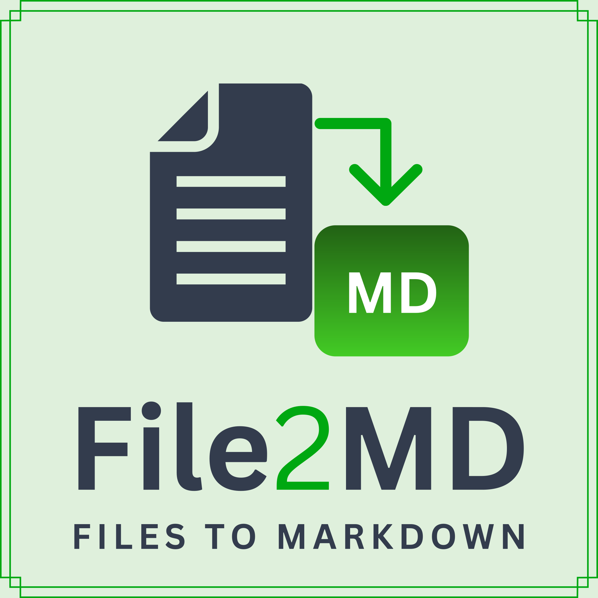
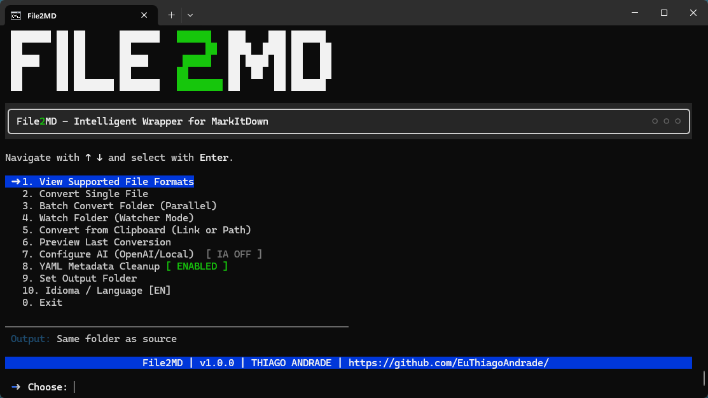
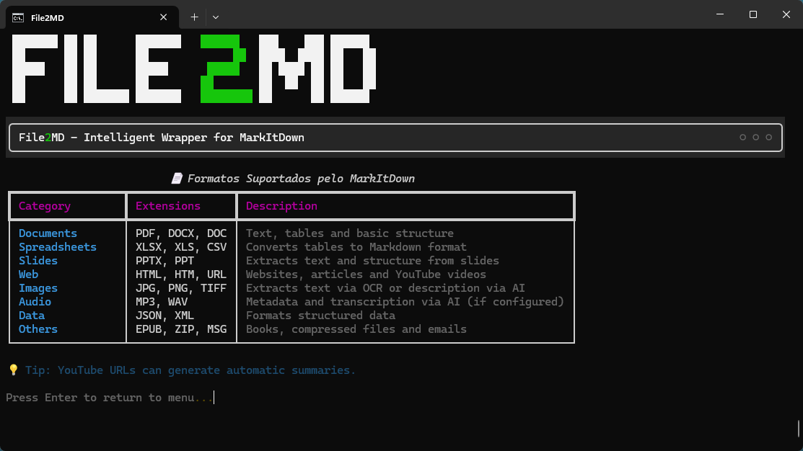

<p align="center">
  
</p>

<p align="center">
  🇧🇷 <a href="README.md">Leia em Português</a> | 🇺🇸 <a href="README_en.md">Read in English</a>
</p>

<p align="center">
  
  <a href="https://github.com/EuThiagoAndrade/File2MD/blob/main/LICENSE">
    
  </a>
  <a href="https://github.com/EuThiagoAndrade/File2MD/commits/main">
    
  </a>
  <a href="https://github.com/EuThiagoAndrade/File2MD/issues">
    
  </a>
  <a href="https://github.com/EuThiagoAndrade/File2MD/stargazers">
    
  </a>
</p>

# File2MD - User Manual

This script is a Python "wrapper" for the **MarkItDown** tool, designed to facilitate the fast and organized conversion of various file formats to Markdown.

---

## Software Interface

<p align="center">
  
  <br>
  <em>Screenshot of the interactive software menu.</em>
</p>

<p align="center">
  
  <br>
  <em>Screenshot of the advanced software options.</em>
</p>

---

## Prerequisites

To use this script, you need:
1.  **Python** installed on your machine (version 3.7+).
2.  **MarkItDown** and other dependencies.

### Installation

Clone the repository and install the dependencies:

```powershell
git clone https://github.com/EuThiagoAndrade/File2MD.git
cd File2MD
pip install -r requirements.txt
```

> [!TIP]
> **Automatic Discovery:** The script is smart! It will attempt to find MarkItDown on its own in your system or in nearby `.venv` and `venv` folders. If it cannot find it, it will prompt you for the path on the first run and save the configuration so you do not have to type it again.

---

## How to Run

The script offers two main modes of operation: **Interactive Menu** and **Command Line Interface (CLI)**.

### 1. Interactive Menu Mode (Recommended)
Run the script without arguments to open the visual interface:

```powershell
python Scripts/File2MD.py
```

**Menu Features:**
*   **Visual Interface**: Design inspired by modern terminals with arrow keys navigation (**↑** and **↓**).
*   **1. Convert Single File**: Support for URLs, PDFs, Office, Images, Audio and more.
*   **2. Batch Convert Folder**: Now with **parallel processing (multi-threading)** for high performance.
*   **3. Watch Folder (Watcher Mode)**: The script monitors a folder and converts new files automatically.
*   **4. Convert from Clipboard**: Detects paths or URLs copied to your clipboard.
*   **5. Integrated Preview**: View the generated Markdown directly in the terminal with rich formatting.
*   **6. AI Configuration**: Integrate with OpenAI or local models for image description and audio transcription.
*   **7. YAML Metadata Cleanup**: Visual control over whether metadata will be removed or kept.
*   **8. Set Output Folder**: Configuration of a standard folder to save the generated files.
*   **Language / Idioma**: Dynamic language switching (Portuguese and English) in the interactive menu with automatic persistence.

---

### 2. Command Line Mode (CLI)
For quick use or in automation.

| Command | Description |
| :--- | :--- |
| `python Scripts/File2MD.py "file.pdf"` | Converts the file with default header cleanup. |
| `python Scripts/File2MD.py "C:\Folder" -d` | Parallel batch processing of an entire folder. |
| `python Scripts/File2MD.py "C:\Input" --watch` | Starts real-time monitoring (Watcher Mode). |
| `python Scripts/File2MD.py "doc.docx" --keep-header` | Converts while keeping the original metadata. |

---

## Intelligence and Configuration

The script now manages settings dynamically:

*   **Native Architecture**: Now uses the MarkItDown Python API directly for greater stability.
*   **Advanced Configuration**: Saves AI keys and preferences in `file2md_config.json`.
*   **Character Correction (Encoding)**: Robust support for Windows, fixing issues with accents.
*   **Smart Cleanup 2.0**: Removes Front Matter, normalizes line breaks, and cleans up residual spaces.
*   **Multimodal**: Support for describing images and transcribing audio via integration with LLMs.
*   **Full Flexibility**: If the script is moved to another machine or directory, it knows how to self-adjust.

---

## Parameter Reference

If you prefer not to use the menu and invoke the script directly via terminal, here are all the available parameters:

| Parameter | Description | Example Use |
| :--- | :--- | :--- |
| `input` | (Positional) The file, folder, or URL you want to convert. | `python Scripts/File2MD.py "doc.pdf"` |
| `-o`, `--output` | Specifies the name or path of the output file. | `python Scripts/File2MD.py "doc.pdf" -o "final.md"` |
| `-d`, `--directory` | Indicates that the input is a folder and should convert everything in it. | `python Scripts/File2MD.py "C:\Docs" -d` |
| `--watch` | Starts monitoring a folder in real time. | `python Scripts/File2MD.py "C:\Docs" --watch` |
| `--keep-header` | Skips automatic cleanup and keeps the original YAML header. | `python Scripts/File2MD.py "doc.pdf" --keep-header` |
| `-h`, `--help` | Shows the official script help with all commands. | `python Scripts/File2MD.py --help` |

---

## Contact

Have any questions, suggestions, or need help?
- **General discussions and ideas:** Access the project's [GitHub Discussions](https://github.com/EuThiagoAndrade/File2MD/discussions).
- **Direct contact (E-mail):** [contato@euthiagoandrade.com.br](mailto:contato@euthiagoandrade.com.br)
